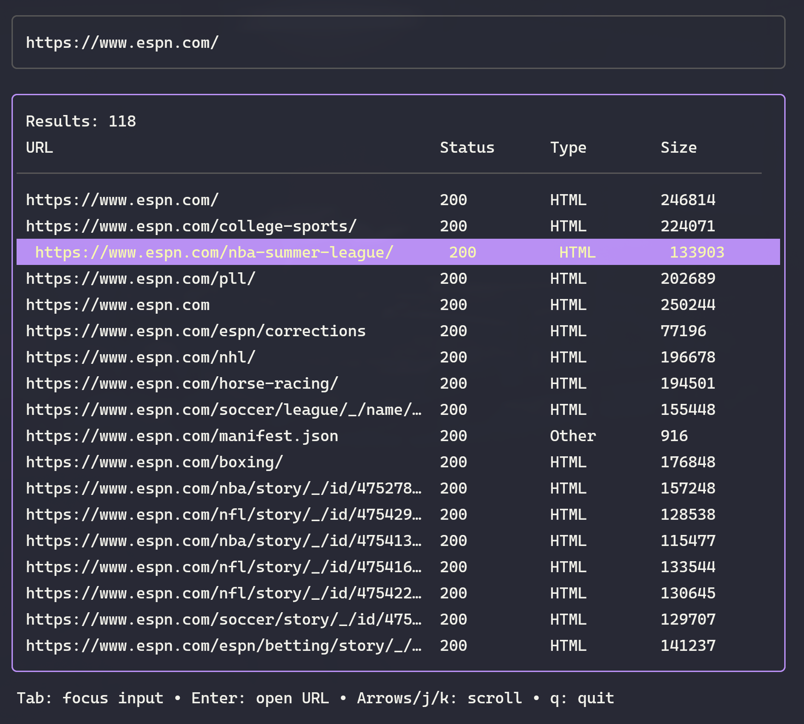

Huntsman
========

Huntsman is a TUI app that spiders a website and lists all the resources it finds within that domain.



Installation
------------

### Quick Install (Recommended)

To install the latest version of `huntsman` (to `/usr/local/bin` on macOS or `~/.local/bin` on Linux):

```bash
curl -sL https://github.com/jturmel/huntsman/releases/latest/download/install.sh | bash
```

The script automatically detects your OS and architecture. Make sure the installation directory (`/usr/local/bin` on macOS or `~/.local/bin` on Linux) is in your `PATH`.

### Manual Install (From Source)

If you have Go installed, you can build and install manually:

```bash
git clone https://github.com/jturmel/huntsman.git
cd huntsman
make build
cp huntsman /usr/local/bin/ # macOS
# OR
cp huntsman ~/.local/bin/  # Linux
```

Usage
-----

1. Run `huntsman`.
2. Enter the URL you want to spider in the input box.
3. Press **Enter** to start the crawl.
4. Use **Tab** to switch between the input box and the results table.
5. In the results table:
    - Use **Arrows** or **j/k** to scroll.
    - Press **Enter** on a highlighted row to open the URL in your default browser.
    - Press **q** to quit.

Contributing
------------

Contributions are welcome! Please follow these guidelines:

1. Fork the repository and create a new branch for your feature or bug fix.
2. Make your changes and ensure the code is well-documented.
3. Write tests for your changes if applicable.
4. Submit a pull request with a clear description of your changes.
